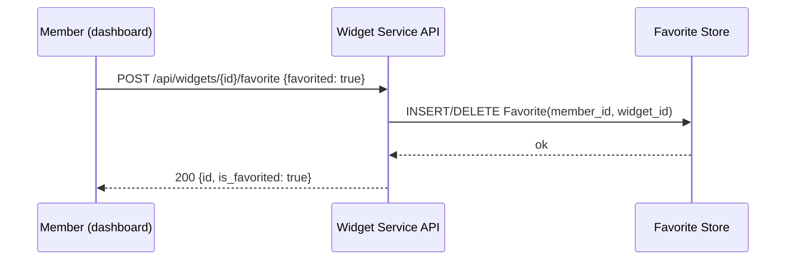

# Widget Favorites Architecture
Type: Architecture
Ticket: EX-100
Status: Draft
Updated: 2026-08-06
Description: Feature architecture for Widget Favorites (synthetic reference example):
  component roles, data flow, integration points, and failure modes within the
  Dashboard Widget service.
---

## Overview

Widget Favorites adds favorite/unfavorite for dashboard widgets, entirely within the
Widget service — no cross-repo or cross-service integration is required.

## Context

### In Scope
- Mark/unmark a widget as favorite
- Show favorite status in the widget list
- A per-member favorite limit (blocked — `OQ-001`, see `scope-of-work.md` `ITEM-03`)

### Out of Scope
- Favorite categories or folders — not requested, no evidence in the PRD
- Sharing/showing another member's favorites — explicitly decided owner-only (`OQ-003`)
- Any cross-service or cross-repo work — this initiative is single-service

## Components

### New
- `Favorite` entity/table (`member_id`, `widget_id`, `created_at`) — see ADR-001
- `POST /api/widgets/{id}/favorite` endpoint
- `POST /api/internal/favorites-cache-warm` internal endpoint

### Changed
- `GET /api/widgets/{id}` — adds `is_favorited` field (`extension`)

### Untouched but relevant
- `GET /api/widgets` — already returns the dashboard widget list; favorite status is
  read into it via the changed endpoint above, this endpoint itself is unmodified

## Communication

### Data Flow

The `favorites-cache-warm` internal endpoint is a fire-and-forget scheduled job with no
synchronous caller waiting on a response — no sequence diagram applies to it; it is
listed in Integration Points below for completeness.

## Integration Points

No cross-repo integration applies to this initiative — every row below is intra-service
(single lane: `backend`, consumed by the `frontend` lane in the same repo).

| Endpoint | Direction | Owning lane | Notes |
|---|---|---|---|
| `GET /api/widgets` | inbound | backend | `existing` — unmodified |
| `GET /api/widgets/{id}` | inbound | backend | `extension` — adds `is_favorited` |
| `POST /api/widgets/{id}/favorite` | inbound | backend | `new` |
| `POST /api/internal/favorites-cache-warm` | internal, scheduled | backend | `internal` — no external caller |

## Auth Model

- Member-facing endpoints (`GET /api/widgets`, `GET /api/widgets/{id}`,
  `POST /api/widgets/{id}/favorite`) require a member session bearer token; a member can
  only favorite/unfavorite on their own behalf (no `member_id` parameter — derived from
  the session).
- `POST /api/internal/favorites-cache-warm` is service-to-service only, authenticated by
  a shared internal token, not reachable by any member-facing client.

## Data Storage

New `Favorite` entity: `member_id`, `widget_id`, `created_at`, indexed on
`(member_id, widget_id)` (see ADR-001 for why this is a dedicated entity rather than the
generic `UserPreference` table).

**Data ownership:** the Widget service is authoritative for favorite state. The widget
catalog itself (name, config) is unaffected and remains owned by its existing model.

## Failure Modes

- **Favorite Store unavailable during `GET /api/widgets/{id}`:** degrade gracefully —
  return the widget with `is_favorited: false` and log the degradation, rather than
  failing the whole request. Favorite status is enhancement data, not core widget data.
- **Favorite Store unavailable during `POST /api/widgets/{id}/favorite`:** fail the
  request with a 503; do not silently accept a favorite action that wasn't persisted.
- **`favorites-cache-warm` fails:** no member-facing impact — the cache warms lazily on
  next read if the scheduled warm fails; log and retry on the next scheduled run.

## Constraints

- Favorite limit enforcement is blocked on `OQ-001` (see `scope-of-work.md` `ITEM-03`) —
  the `Favorite` entity's index already supports the count query the limit will need
  once decided (ADR-001, Consequence 1).
- No cross-repo topology constraints apply — see Communication above.

## See Also

- `discovery-brief.md` — the approved Discovery Brief this architecture follows from
- `decisions/ADR-001-dedicated-favorite-entity.md` — governs the `Favorite` entity
  choice in Components and Data Storage above
- `widget-api-contract.md` — full contract for every endpoint in Integration Points
- `scope-of-work.md` — scope items implementing this architecture
