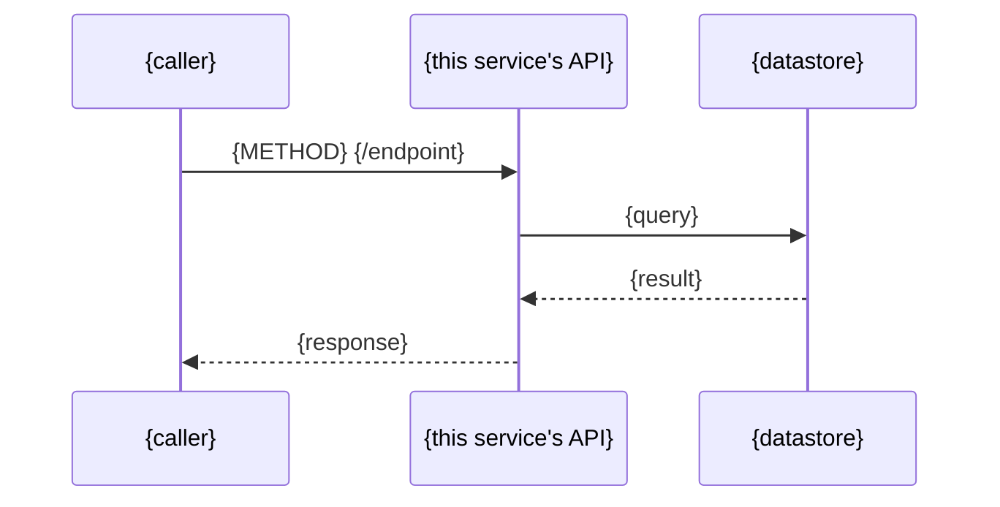

## Governance

This skill operates under the [SAGE Constitution](../../constitution/SAGE-CONSTITUTION.md).
It is the primary implementation of **D8 (architecture must satisfy the completeness
criterion, or mark items N/A)** — the spec this skill produces must address every item
in Article V, explicitly, or say why an item does not apply. Silently omitting a
dimension is a D8 violation, not a stylistic choice.

## What I do

Produce a feature architecture spec: how a new initiative's components fit into the
existing system, how they communicate, what they depend on, and what could go wrong.
Covers the 8 dimensions the SAGE Constitution's Article V requires — several of which
are easy to skip if not asked for explicitly (integration points' owning lane, auth
model, and failure modes are the three most commonly missing in practice).

## When to use me

- An initiative's brief-flagged ADRs (via `adr-writer`) are written — architecture
  decisions should already be settled before drawing the architecture they inform
- Before `scope-mapper` — scope items reference this spec's integration points and
  component boundaries
- If drafting this spec surfaces a new decision point not covered by an existing ADR,
  stop and invoke `adr-writer` for it before continuing (see Step 3)

## Pre-conditions

- Discovery Brief approved (Article IV gate passed)
- Any brief-flagged ADRs already written (`adr-writer` output) — this spec should cite
  them, not re-litigate them
- The repo's own spec index and cross-repo topology doc have been read (Step 1)

## Inputs

| Input | Source |
|---|---|
| Discovery Brief | `discover-prd` output |
| ADRs governing this initiative | `adr-writer` output |
| Verified/proposed API contract | `api-contract-extractor` output (`status`-tagged) |
| Repo's spec index | e.g. `docs/specs/README.md` |
| Cross-repo topology doc, if one exists | e.g. `docs/specs/ecosystem.md` |

## Steps

### Step 1 — Read before drafting

- Read the repo's spec index (e.g. `docs/specs/README.md`) — do not draft a second
  architecture doc for a domain that already has one; extend it or add an
  initiative-scoped one (see File placement below).
- Read the repo's cross-repo topology doc, if one exists (e.g. `docs/specs/ecosystem.md`)
  — **required before drawing any diagram that crosses a repo/service boundary.** A
  diagram that shows a caller talking directly to a system the topology says it cannot
  reach is a D5 violation (invented behaviour), not just an inaccuracy.
- Read the ADR(s) governing this initiative — cite them in Context, don't restate their
  reasoning.

### Step 2 — Draft each Article V dimension

One subsection per row below. If a dimension genuinely does not apply, write the
subsection heading anyway and state `N/A — {one-line reason}` under it — never omit
the heading (D8).

| Article V dimension | Section | Notes |
|---|---|---|
| 1. Component map | `## Components` | Split explicitly into **New**, **Changed**, **Untouched-but-relevant** — not one flat list |
| 2. Sequence diagram per flow | `## Communication` → `### Data Flow` | One Mermaid `sequenceDiagram` per user-facing or system-facing flow; see template below |
| 3. Data model changes | `## Data Storage` | New/changed entities, fields, relationships |
| 4. Integration points + owning lane | `## Integration Points` | **Commonly missing.** Table: endpoint/interface, direction, owning lane (matches `scope-mapper`'s `**Lanes:**` vocabulary) |
| 5. Auth model | `## Auth Model` | **Commonly missing.** Who can call what, under what token/session/role |
| 6. Failure modes | `## Failure Modes` | **Commonly missing.** What happens when a dependency is unavailable, times out, or rejects the request |
| 7. Data ownership | (inside `## Data Storage`, called out explicitly) | Which system is authoritative for which data — do not leave this implicit inside a schema diagram |
| 8. Constraints and non-goals | `## Context` → `### In Scope` / `### Out of Scope` | Explicit non-goals, not just what's in scope |

### Step 3 — Handle newly-surfaced decisions

If drafting a section (commonly Integration Points or Auth Model) surfaces a choice
between ≥ 2 real options that no existing ADR covers, **stop** — do not silently pick
one and write it into the architecture as settled fact (D1/D2). Invoke `adr-writer` for
it, then resume drafting once it's decided. This is the loop the SAGE Constitution's
Discovery sequence describes as "ADRs → architecture, iterating."

### Step 4 — Completeness self-check

Before finalising, check the doc against Article V's 8 items line by line (the table in
Step 2). Every item is either addressed or explicitly marked N/A with a reason. This is
the D8 self-check standing in for a deterministic audit — treat it as a hard gate on
this artifact, not a suggestion.

## Metadata header

```
# {Initiative} Architecture
Type: Architecture
Ticket: {Jira key, omit if none}
Status: Draft
Updated: {today YYYY-MM-DD}
Description: Feature architecture for {initiative}: component roles, data flow, integration points, and failure modes within the {system} system.
---
```

## Required sections

```
## Overview
## Context
### In Scope
### Out of Scope
## Components
### New
### Changed
### Untouched but relevant
## Communication
### Data Flow
## Integration Points
## Auth Model
## Data Storage
## Failure Modes
## Constraints
## See Also
```

**Communication section rules:**
- Use a Mermaid `sequenceDiagram` for every request/response flow this initiative adds
  or changes
- Read the repo's cross-repo topology doc before drawing — topology constraints apply
  (Step 1)
- See Also must link back to the repo's system-wide architecture doc and topology doc,
  if they exist

**Mermaid sequence template** (generic — replace participants with the actual systems
involved; do not hard-code a specific stack's component names):



**Integration Points table format:**

```markdown
## Integration Points

| Endpoint / interface | Direction | Owning lane | Notes |
|---|---|---|---|
| {METHOD} {/path} | inbound / outbound | {lane name, e.g. backend, or a cross-repo team} | {status: existing/extension/new — from api-contract-extractor} |
```

## File placement and naming

```
docs/specs/{domain}/architecture.md
```

If a file already exists at that path for the domain (i.e. a system-wide or prior
architecture doc), use `docs/specs/{domain}/{initiative-slug}-architecture.md` instead
— do not overwrite an existing domain architecture doc with an initiative-scoped one.

Update the repo's spec index with the new entry.

## Completeness checklist before finalising

- [ ] Components split into New / Changed / Untouched but relevant — not one flat list
- [ ] At least one sequence diagram per new or changed flow
- [ ] Data model changes stated, with data ownership called out explicitly
- [ ] `## Integration Points` present with an owning lane per row, or explicitly N/A
- [ ] `## Auth Model` present, or explicitly N/A with reason
- [ ] `## Failure Modes` present, or explicitly N/A with reason
- [ ] Non-goals stated explicitly in `### Out of Scope`, not left implicit
- [ ] No diagram shows a caller reaching a system the topology doc says it cannot reach
- [ ] Every decision this spec depends on has a governing ADR cited, not re-argued inline
- [ ] File is linked from the repo's spec index

## Output

`docs/specs/{domain}/architecture.md` (or `{initiative-slug}-architecture.md`) — feeds
`scope-mapper`, whose scope items reference this spec's integration points and
component boundaries.

## Reference output

`../../reference/example-initiative/architecture.md` — small, but demonstrates every
Article V dimension for a 4-item toy initiative, including one dimension marked
explicitly `N/A` with a reason (not every dimension is substantial for every initiative
— the point is stating that, not padding a section that has nothing to say).

## See Also

- `../../constitution/SAGE-CONSTITUTION.md` — Article V (the completeness criterion this
  skill implements) and Article II D8
- `skills/adr-writer/SKILL.md` — decisions this spec should cite, not re-litigate
- `skills/scope-mapper/SKILL.md` — consumes this spec's integration points and
  component boundaries
- `skills/discovery-lead/SKILL.md` — sequences this skill between `adr-writer` and
  `scope-mapper`
